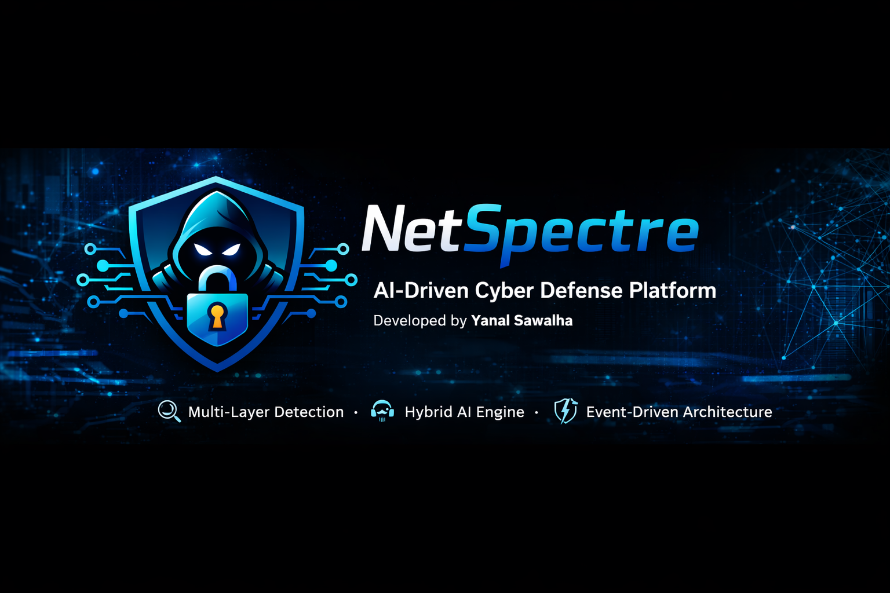

<p align="center">
  
</p>


# 🧠 NetSpectre – AI-Driven Cyber Defense & SOC Intelligence Platform

NetSpectre is a next-generation **AI-powered cybersecurity platform** designed to redefine how modern intrusion detection systems operate in complex, high-speed, and encrypted environments.

Unlike traditional IDS solutions that rely on static signatures, NetSpectre introduces a fully **intelligent, behavior-driven, and multi-layered detection framework** capable of identifying both known and **zero-day threats** with high precision.

---

## 🚀 Core Capabilities

### 🔍 Multi-Layer Detection

* 🌐 **Layer 2/3:** Behavioral anomaly detection using flow-based analysis
* 🌍 **Layer 7:** Deep learning inspection of HTTP traffic
* 🔐 Detection works even in **encrypted environments**

---

### 🤖 Hybrid AI Engine

* ⚡ **XGBoost Models:** Fast, interpretable detection of network anomalies
* 🧬 **Deep Learning (CNN):** Detection of obfuscated SQL Injection attacks
* ⚖️ Balanced approach between **speed, accuracy, and explainability**

---

### ⚡ Event-Driven Architecture

* 📡 Central **Message Queue** for asynchronous processing
* 🔗 Decouples detection from analysis
* 🧱 Highly **scalable, modular, and fault-tolerant**

---

### 🧠 SOC AI Agent

* 🔄 Cross-layer correlation (L2/L3 + L7)
* ⏱️ Temporal and behavioral analysis
* 💬 Human-readable explanations
* 🎯 Reduces false positives & alert fatigue

---

### 📊 Visualization & Monitoring

* 🖥️ Real-time dashboard (React + TypeScript)
* 📈 Interactive threat analytics & timelines
* 🗂️ Integrated with OpenSearch for logging & forensics

---

## 🏗️ Architecture Overview

* 📥 **Traffic Acquisition Layer** → Packet capture & flow extraction
* 🤖 **AI Detection Layer** → ML + DL models
* 📡 **Message Queue Layer** → Event-driven pipeline
* 🧠 **SOC AI Agent** → Intelligent analysis & reasoning
* 📊 **Visualization Layer** → Monitoring & incident response

---

## 🛡️ Detected Threats

* 🧭 Port Scanning & Reconnaissance
* 🌊 SYN Flood & Connection Abuse
* 🔁 Lateral Movement
* 💉 SQL Injection (including obfuscated payloads)
* ⚠️ Behavioral anomalies & zero-day indicators

---

## 🧪 Why NetSpectre?

* 🧠 Moves beyond signature-based detection
* 🔍 Detects attacks missed by traditional IDS
* 🔐 Works under encrypted traffic conditions
* ⚡ Real-time, scalable, and AI-driven
* 🎯 Designed for modern SOC environments

---

## 🧩 Technologies

* 🐍 Python (Scapy, ML/DL frameworks)
* 🌲 XGBoost (Machine Learning)
* 🧬 CNN (Deep Learning)
* ⚡ FastAPI (Backend APIs)
* ⚛️ React + TypeScript (Frontend)
* 🔎 OpenSearch (Logging & Forensics)

---

## 🎯 Vision

NetSpectre represents a shift from **traditional IDS → intelligent security platforms**.

It doesn’t just detect attacks…
👉 It **understands**, **explains**, and **supports decision-making**.

---

💡 Developed as a Graduation Project in Network Information Security
🚀 Designed for real-world cybersecurity challenges

## 📦 Requirements

To run NetSpectre, make sure you have the following installed:

### 🖥️ System
- Linux (Recommended: Kali Linux / Ubuntu)
- Python 3.8+

### 🧠 Python Libraries
- scapy
- numpy
- pandas
- scikit-learn
- xgboost
- tensorflow / pytorch
- fastapi
- uvicorn

### 🔧 Optional Tools
- nmap (for testing)
- sqlmap (for SQL injection simulation)
- Wireshark (for traffic analysis)

## 📥 Capturing Traffic Network L(2/3)

### 🔧 Step 1: Prepare the Lab Environment

To generate realistic attack traffic, set up a vulnerable environment:

- 🐧 Attacker Machine: Kali Linux  
- 🎯 Target Machine: Metasploitable2  

👉 You can download Metasploitable from:
https://sourceforge.net/projects/metasploitable/


### 🌐 Step 2: Configure Network (Kali ↔ Metasploitable)

1. Open your VM settings (VirtualBox / VMware)  
2. Set both machines to the same network:
	   - **Host-Only Adapter** (recommended)  
	   - or **NAT Network**

3. Verify connectivity:

	```bash
	ping <metasploitable-ip>
	```
	### 🔍 Step 3: Capture Network Traffic (Layer 2/3)
	```bash
	sudo tcpdump -i <interface> -w capture.pcap
	```
4. Generate Abnormal Traffic 
	🔴 Port Scanning (Reconnaissance)
	```bash
	nmap -sS <target-ip>
	```
	
---
## 🌍 Capturing Traffic – Application Layer (Layer 7)

This section focuses on capturing and analyzing **web application traffic (HTTP/HTTPS)** to detect attacks such as SQL Injection, XSS, and other application-layer threats.

### 🔧 Step 1: Setup Interception Proxy (Burp Suite)

Use :contentReference[oaicite:0]{index=0} to intercept and inspect web traffic:

1. Launch Burp Suite  
2. Go to **Proxy → Intercept → ON**  
3. Configure your browser proxy:
   - IP: `127.0.0.1`
   - Port: `8080`


### 🌐 Step 2: Configure Browser

- Open browser settings  
- Set manual proxy:
  - HTTP Proxy → `127.0.0.1:8080`  
- Install Burp CA Certificate (for HTTPS interception)


### 🎯 Step 3: Target a Vulnerable Web App

Use a vulnerable application such as:

- DVWA (Damn Vulnerable Web Application)  
- Mutillidae (on Metasploitable) 
- PortSwigger : https://portswigger.net/ 
- Tryhackme   : https://tryhackme.com/ 
- Owasp       : https://owasp.org/ 
- HackBox     : https://www.hackthebox.com/

👉 Example:
```bash
sqlmap -u "http://<target-ip>/mutillidae/index.php?page=user-info.php" --batch
```
---

# 🧪 Data Extraction & Feature Engineering
NetSpectre uses a custom-built feature extraction engine to transform raw packet captures into structured data suitable for machine learning models such as XGBoost.

---
## A- Data Extraction – XGBoost Models

### First Model 🟥 Flow-Based Model
Analyzes network flows and protocol-level behavior:
- TCP flags (SYN, ACK, FIN)
- Packet rates and sizes
- Scan detection heuristics

#### ⚙️ How It Works

The extraction pipeline processes `.pcap` files and converts raw network traffic into **flow-based features** that represent behavioral patterns of network activity.

Each network flow is analyzed and transformed into a numerical feature vector used for training and detection.


#### ▶️ Run Feature Extraction

```bash
python extract_first_xgboost.py -f capture.pcap -o features.csv -l 1 -a SYN_SCAN
python extract_first_xgboost.py -f capture.pcap -o features.csv -l 2 -a SSH_BruteForce

```
### Second MODEL 🟦 Temporal Model
Analyzes traffic behavior over time windows:
- Packets per second
- Burstiness
- Inter-arrival time
- Active vs idle ratios

#### ▶️ Run Feature Extraction

```bash
python extract_behaviar.py -i capture.pcap -o temporal.csv -l 1
```

💡 Both models work together to provide accurate and robust detection across multiple attack types.

## B- Data Extraction – 🧬 Deep Learning (CNN Model)

NetSpectre leverages a Convolutional Neural Network (CNN) to detect SQL Injection attacks at the Application Layer (Layer 7) by performing deep semantic analysis of HTTP request payloads.

Unlike traditional rule-based systems, this approach enables the detection of obfuscated, encoded, and zero-day injection patterns through learned representations.

🌐 Payload Sources (Attack Vectors)

The system extracts and analyzes payloads from multiple components of HTTP requests to ensure comprehensive coverage:

🔎 Query → GET Attacks
Injection attempts embedded within URL parameters

Example:

/login.php?id=1' OR '1'='1
📦 Body → POST Attacks
Malicious input submitted via forms or APIs

Example:

username=admin'--&password=123
🍪 Cookie → Session-Based Attacks
Exploitation of session tokens and cookies

Example:

session=admin' OR '1'='1
🧠 Advanced SQL Feature Engineering

To enhance detection accuracy, NetSpectre extracts a rich set of statistical and structural features from each payload:

📏 Payload length and parameter count
🔢 Digit ratio and numerical patterns
🔣 Special character distribution
💬 Quote usage (', ")
🧾 SQL comment indicators (--, #, /* */)
⚙️ Operator frequency (=, <, >, +, -)
🔐 Encoding ratio (URL-encoded content %)
🧬 Shannon Entropy for randomness and obfuscation detection

These features allow the system to identify anomalous and adversarial input patterns beyond simple signature matching.

🧬 Token-Based Structural Analysis

Payloads are further decomposed into tokens to capture syntactic and semantic patterns:

🔤 Token count
📏 Longest token length
📊 Average token length
🔍 Detection of suspicious keywords (e.g., OR, UNION, SELECT, DROP)

This layer enables the CNN model to understand contextual relationships within malicious inputs.

⚙️ Burp Suite Integration

NetSpectre supports direct integration with Burp Suite for extracting real-world attack traffic from XML exports.

▶️ Run Extraction
🔴 Attack Traffic
```bash
python burbsute_to_CSV.py -f burp.xml -o out.csv -ex all
python burbsute_to_CSV.py -f burp.xml -o out.csv -ex cookie
```
```bash
python cnn_futers.py -f <PCAP File> -o out.csv 
```
🎯 Extraction Modes
query → Extract payloads from URL parameters (GET)
body → Extract payloads from request body (POST)
cookie → Extract session/cookie-based payloads
all → Full-spectrum extraction across all vectors 🔥
🤖 Why CNN?
🧠 Learns deep patterns in payload structure (similar to NLP models)
🔍 Detects obfuscated and polymorphic SQL Injection attacks
⚡ Effective against zero-day threats
🎯 Significantly reduces reliance on static signatures


🟢 Normal Data Extraction
```bash
python extract_normal.py -f <norma_file> -o normal_dataset.csv
```
⚖️ Why Separate Pipelines?

Using separate scripts is not a limitation — it’s actually best practice:

🎯 Ensures clean labeling (no mixed data)
🧠 Improves model learning (clear distinction)
📊 Reduces false positives
🔍 Enables better feature distribution analysis

🧪 Output Dataset

The final output is a structured dataset (CSV) containing:

Engineered numerical features
Original payload (for traceability)
Label (Attack / Normal)
Attack type (e.g., SQL Injection)
---

## 🎥 Demo

▶️ Watch the full system demo:  
https://www.youtube.com/watch?v=GbtuoEiHKNM&list=PL31p22KO8YfjOR7V7Zzcue3DLjQdwASyP  

<div align="center">


**📱 Scan to watch instantly**

</div>

💡 This demo showcases:

- 🚀 Real-time attack detection and alert generation  
- 🤖 AI-powered threat classification and anomaly detection  
- 🧠 SOC-level intelligent analysis and decision support  
- 🔄 Cross-layer correlation (L2/L3 + L7 attacks)  
- ⚡ Detection of stealth and obfuscated attacks  
- 🔐 Analysis of traffic in encrypted environments  
- 📊 Interactive dashboard with live threat visualization  
- 🧭 Behavioral analysis of network traffic patterns  
- 💬 Human-readable explanations for detected threats  
- 🎯 Reduced false positives using AI correlation  
- 🔎 Deep inspection of application-layer attacks (e.g., SQL Injection)  
